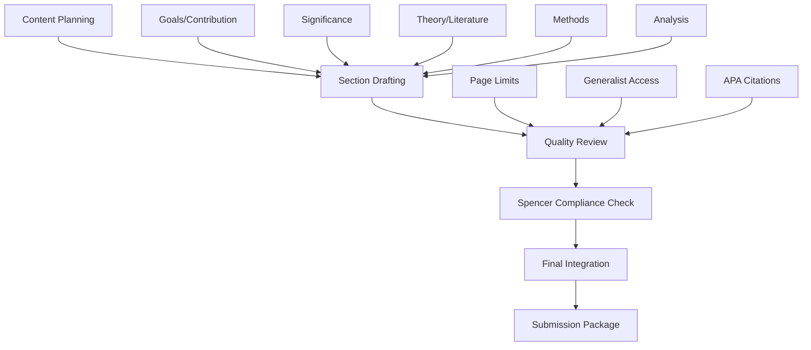

# Design Document

## Overview

This design document outlines the architecture and approach for creating a fellowship-ready Narrative Discussion that meets all NAEd/Spencer Dissertation Fellowship requirements. The design focuses on producing a persuasive, well-structured 10-page narrative with 2-page bibliography that maximizes reviewer alignment through systematic content organization and quality assurance.

## Steering Document Alignment

### Technical Standards (tech.md)
This design follows academic writing best practices and systematic content development patterns suitable for fellowship applications.

### Project Structure (structure.md)  
The implementation will follow a structured approach to narrative development with clear phases, templates, and validation checkpoints.

## Code Reuse Analysis

### Existing Components to Leverage
- **Spencer Fellowship Guidelines**: Direct requirements from the NAEd/Spencer application guide
- **Resource Documents**: overview-dissertation, optimization-methods, qual_exam content for theoretical grounding
- **Templates and Examples**: APA style guides, academic writing resources

### Integration Points
- **Existing Research Content**: Integration with current dissertation research and methodology
- **Spencer Evaluation Criteria**: Alignment with importance, feasibility, authorship quality, and education relevance

## Architecture

The narrative design follows a systematic content development approach with clear section organization, page allocation, and quality validation.

### Modular Design Principles
- **Single Section Responsibility**: Each narrative section addresses specific Spencer evaluation criteria
- **Content Isolation**: Sections maintain focus while supporting overall narrative coherence  
- **Template Separation**: Reusable structures for different narrative components
- **Quality Modularity**: Independent validation approaches for different content types



## Components and Interfaces

### Component 1: Narrative Structure Framework
- **Purpose:** Organize content into Spencer-required sections with appropriate page allocations
- **Interfaces:** Section templates, transition guidelines, page limit tracking
- **Dependencies:** Spencer Fellowship requirements, academic writing standards
- **Reuses:** Requirements document section specifications

### Component 2: Content Development System  
- **Purpose:** Generate compelling content for each narrative section
- **Interfaces:** Section-specific writing guides, example structures, evaluation criteria
- **Dependencies:** Existing research materials, theoretical frameworks
- **Reuses:** overview-dissertation, optimization-methods, qual_exam content

### Component 3: Quality Assurance Framework
- **Purpose:** Ensure Spencer compliance, readability, and submission readiness
- **Interfaces:** Compliance checklists, readability validators, citation checkers
- **Dependencies:** Spencer evaluation criteria, APA style guidelines
- **Reuses:** Fellowship application requirements, academic standards

## Data Models

### Narrative Section Model
```
- section_id: unique identifier
- title: section heading
- page_allocation: target length (0.25-1.25 pages)
- spencer_criteria: evaluation criteria addressed
- content_requirements: specific elements to include
- dependencies: connections to other sections
```

### Content Validation Model
```
- validation_type: compliance/readability/citation check
- criteria: specific requirements to verify
- status: pass/fail/needs_revision
- feedback: specific improvement suggestions
```

## Error Handling

### Error Scenarios
1. **Page Limit Exceeded:** Content exceeds 10-page narrative limit
   - **Handling:** Section-by-section content reduction with priority preservation
   - **User Impact:** Clear guidance on what to trim while maintaining quality

2. **Spencer Criteria Gaps:** Missing required narrative elements
   - **Handling:** Systematic checklist review with specific addition recommendations
   - **User Impact:** Step-by-step guidance to address missing components

3. **Generalist Accessibility Issues:** Content too technical for cross-disciplinary reviewers
   - **Handling:** Jargon identification and definition suggestions
   - **User Impact:** Clear recommendations for improving accessibility

4. **Citation/Bibliography Problems:** APA formatting errors or missing sources
   - **Handling:** Automated citation validation and correction suggestions
   - **User Impact:** Specific formatting fixes and source completion guidance

## Implementation Strategy

### Phase 1: Content Framework (Days 1-2)
- Develop section templates with page allocations
- Create content requirement checklists
- Establish transition and flow guidelines

### Phase 2: Section Development (Days 3-8) 
- Draft each narrative section following templates
- Integrate existing research content appropriately
- Maintain generalist accessibility throughout

### Phase 3: Quality Assurance (Days 9-10)
- Spencer compliance review against evaluation criteria
- Page limit optimization and content refinement
- APA citation and bibliography completion

### Phase 4: Final Integration (Day 11)
- Combine narrative and bibliography into single document
- Final formatting and header/pagination check
- Submission package preparation

## Success Metrics

- **Spencer Compliance:** 100% coverage of required narrative elements
- **Page Limits:** ≤10 pages narrative + ≤2 pages bibliography  
- **Readability:** Accessible to generalist reviewers while maintaining scholarly rigor
- **Citation Quality:** Complete APA-formatted bibliography with accurate in-text citations
- **Submission Readiness:** Combined document meeting all formatting requirements
